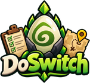
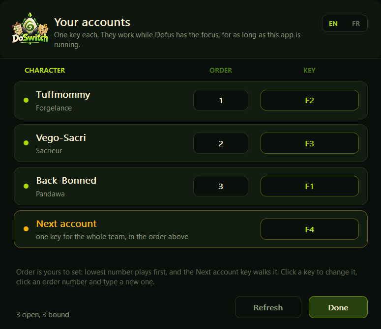

<div align="center">



### One key per Dofus window. Nothing else.
### Une touche par fenetre Dofus. Rien d'autre.

[](LICENSE)
[](#)
[](#)
[](#)

**[English](#english) &nbsp;&middot;&nbsp; [Francais](#francais)**



</div>

---

## English

### What it is

DoSwitch gives every open Dofus window a key. Press it and that window comes
to the front, instantly. Give the whole team one key instead and it walks
them in the order you chose.

That is the entire program. It is one executable of about 460 KB, it sits in
the tray, it uses around 2 MB of memory and no CPU at all when you are not
pressing anything.

- **No installer, no runtime, no dependencies.** Download, run.
- **Your keys are yours.** They are swallowed while Dofus is in front and
  passed straight through everywhere else, so binding F1 does not break F1
  in your browser.
- **Bound to the character, not the window.** Close the client, log back in
  tomorrow, the key still works.
- **English and French**, switched with the toggle in the panel.

### Install

1. Download `DoSwitch.exe` from [Releases](../../releases).
2. Run it. It appears in the tray, next to the clock.
3. Left click the tray icon to open the panel.

Nothing is written outside `%APPDATA%\DoSwitch`, and nothing runs at startup
unless you ask for it in the tray menu.

### Use

| Action | How |
| --- | --- |
| Set a key | Click the key button, press the key you want |
| Remove a key | Click the key button, press Backspace |
| Set the order | Click the order number, type 1 to 9 |
| Switch now | Click the row |
| One key for the team | Set a key on **Next account** |
| Open the panel | Left click the tray icon |
| Start with Windows | Right click the tray icon |

Keys can carry Ctrl, Alt and Shift: hold them while you press, and the button
will read `Ctrl+F1`.

**Order** decides what the *Next account* key does: it goes to the next
character down the list, and back to the top after the last one. It starts
from whichever window is in front, so switching by hand never confuses it.

### Where the settings live

`%APPDATA%\DoSwitch\settings.json`, in plain JSON, keyed on the character
name:

```json
{
  "language": "en",
  "next": "F4",
  "accounts": {
    "Tuffmommy":   { "key": "F2", "order": 1 },
    "Vego-Sacri":  { "key": "F3", "order": 2 },
    "Back-Bonned": { "key": "F1", "order": 3 }
  }
}
```

Copy that file to another machine and your keys come with you.

### Build it yourself

```sh
cargo build --release
```

That is all it needs: a stable Rust toolchain on Windows. The result is
`target/release/doswitch.exe`.

### How it works

- The open windows are found with `EnumWindows`, matched by the process they
  belong to and the title shape the game gives a logged in character.
- A key is caught with a low level keyboard hook, which is what lets the same
  key be swallowed in the game and left alone everywhere else.
- Bringing a window forward is `AttachThreadInput` plus `SetForegroundWindow`,
  with `SwitchToThisWindow` as the fallback. Windows refuses a plain
  `SetForegroundWindow` from a background program, and refuses it silently.
- The panel is painted into one bitmap with GDI and blitted in a single call,
  which is why there is no flicker and no framework.

Nothing is injected into the game, no memory is read, no file of the game is
touched, and nothing is sent anywhere. DoSwitch only ever asks Windows which
windows exist and asks Windows to raise one.

### Questions

**Is this allowed?** DoSwitch does to the game exactly what Alt+Tab does. It
does not automate play, does not read the game, and does not talk to the
servers. Multi-account play itself is your own responsibility and your own
account's rules.

**Why does my antivirus look twice?** A keyboard hook is the same mechanism a
keylogger uses. The difference is what is done with it, and the whole of that
is in `src/hook.rs`: a key that is not one of yours is passed on untouched
and never recorded. The source is here so you do not have to take that on
trust.

**A key does nothing.** The key only acts while a Dofus window is in front.
If it still does nothing, another program may have taken it first.

**The window does not come forward.** Windows will refuse to hand the
foreground from a lower privilege program to a higher one. Run DoSwitch the
same way you run the game, without administrator rights on either.

### Licence

MIT. See [LICENSE](LICENSE).

---

## Francais

### Ce que c'est

DoSwitch donne une touche a chaque fenetre Dofus ouverte. Vous appuyez, la
fenetre passe devant, immediatement. Ou bien vous donnez une seule touche a
toute l'equipe et elle les parcourt dans l'ordre que vous avez choisi.

C'est tout le programme. Un seul executable d'environ 460 Ko, dans la zone de
notification, environ 2 Mo de memoire et aucun processeur tant que vous
n'appuyez sur rien.

- **Pas d'installateur, pas de runtime, aucune dependance.** Telechargez,
  lancez.
- **Vos touches restent les votres.** Elles sont captees quand Dofus est au
  premier plan et laissees passer partout ailleurs: lier F1 ne casse pas F1
  dans votre navigateur.
- **Liees au personnage, pas a la fenetre.** Fermez le client, reconnectez
  vous demain, la touche fonctionne toujours.
- **Francais et anglais**, avec l'interrupteur dans le panneau.

### Installation

1. Telechargez `DoSwitch.exe` depuis les [Releases](../../releases).
2. Lancez le. Il apparait dans la zone de notification, a cote de l'heure.
3. Clic gauche sur l'icone pour ouvrir le panneau.

Rien n'est ecrit en dehors de `%APPDATA%\DoSwitch`, et rien ne demarre avec
Windows tant que vous ne le demandez pas dans le menu.

### Utilisation

| Action | Comment |
| --- | --- |
| Definir une touche | Cliquez le bouton de touche, appuyez sur la touche |
| Retirer une touche | Cliquez le bouton de touche, appuyez sur Retour arriere |
| Definir l'ordre | Cliquez le numero d'ordre, tapez 1 a 9 |
| Basculer maintenant | Cliquez la ligne |
| Une touche pour l'equipe | Definissez une touche sur **Compte suivant** |
| Ouvrir le panneau | Clic gauche sur l'icone |
| Demarrer avec Windows | Clic droit sur l'icone |

Les touches acceptent Ctrl, Alt et Maj: maintenez les en appuyant, le bouton
affichera `Ctrl+F1`.

**L'ordre** commande la touche *Compte suivant*: elle va au personnage
suivant dans la liste, et revient au premier apres le dernier. Elle part de
la fenetre qui est devant, donc basculer a la main ne la perd jamais.

### Ou sont les reglages

`%APPDATA%\DoSwitch\settings.json`, en JSON lisible, indexe par le nom du
personnage:

```json
{
  "language": "fr",
  "next": "F4",
  "accounts": {
    "Tuffmommy":   { "key": "F2", "order": 1 },
    "Vego-Sacri":  { "key": "F3", "order": 2 },
    "Back-Bonned": { "key": "F1", "order": 3 }
  }
}
```

Copiez ce fichier sur une autre machine et vos touches vous suivent.

### Compiler soi-meme

```sh
cargo build --release
```

Il ne faut rien de plus qu'une chaine Rust stable sous Windows. Le resultat
est `target/release/doswitch.exe`.

### Comment ca marche

- Les fenetres ouvertes sont trouvees avec `EnumWindows`, reconnues par leur
  processus et par la forme du titre que le jeu donne a un personnage
  connecte.
- Une touche est captee par un hook clavier bas niveau, ce qui permet a la
  meme touche d'etre prise dans le jeu et laissee tranquille ailleurs.
- Mettre une fenetre devant, c'est `AttachThreadInput` puis
  `SetForegroundWindow`, avec `SwitchToThisWindow` en secours. Windows refuse
  un `SetForegroundWindow` venant d'un programme en arriere plan, et il le
  refuse silencieusement.
- Le panneau est dessine dans une seule image GDI et affiche en un seul
  transfert: pas de scintillement, pas de framework.

Rien n'est injecte dans le jeu, aucune memoire n'est lue, aucun fichier du
jeu n'est touche, et rien n'est envoye nulle part. DoSwitch demande a Windows
quelles fenetres existent et lui demande d'en mettre une devant.

### Questions

**Est-ce autorise?** DoSwitch fait au jeu exactement ce que fait Alt+Tab. Il
n'automatise pas le jeu, ne le lit pas, et ne parle pas aux serveurs. Le
multi-compte lui meme releve de votre responsabilite et des regles de votre
compte.

**Pourquoi mon antivirus regarde deux fois?** Un hook clavier est le meme
mecanisme qu'un enregistreur de frappe. La difference est ce qu'on en fait,
et tout cela tient dans `src/hook.rs`: une touche qui n'est pas l'une des
votres est transmise intacte et n'est jamais enregistree. Le code est ici
pour que vous n'ayez pas a nous croire sur parole.

**Une touche ne fait rien.** La touche n'agit que si une fenetre Dofus est
devant. Si elle ne fait toujours rien, un autre programme l'a peut etre
prise avant.

**La fenetre ne passe pas devant.** Windows refuse de donner le premier plan
d'un programme moins privilegie a un plus privilegie. Lancez DoSwitch comme
vous lancez le jeu, sans droits administrateur ni pour l'un ni pour l'autre.

### Licence

MIT. Voir [LICENSE](LICENSE).
